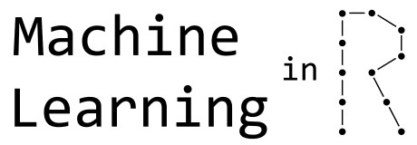
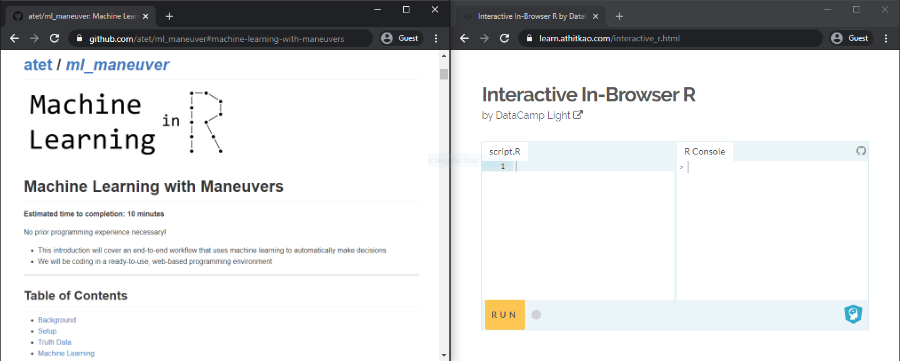
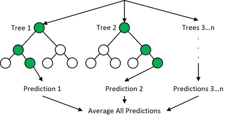

```{r setup, include=FALSE}
knitr::opts_chunk$set(echo = TRUE)
knitr::opts_chunk$set(
  fig.path = ".img/README_"
)
```

<a name="machine-learning-with-maneuvers"></a>

# [atet](https://github.com/atet) / [**_ml_maneuver_**](https://github.com/atet/ml_maneuver#machine-learning-with-maneuvers)

[](#nolink)

# Machine Learning with Maneuvers

**Estimated time to completion: 10 minutes**

No prior programming experience necessary!

* This introduction will cover an end-to-end workflow that uses machine learning to automatically make decisions
* We will be coding in a ready-to-use, web-based programming environment 

---

<a name="table-of-contents"></a>

## Table of Contents

* [Background](#background)
* [Setup](#setup)
* [Truth Data](#truth-data)
* [Machine Learning](#machine-learning)
   * [Training](#training)
   * [Testing](#testing)
* [Next Steps](#next-steps)

---

<a name="background"></a>

## Background

We will leverage technology that will allow computer code to learn from examples, then use what the code has learned from to automatically distinguish between different classes of new, never before seen data.

The examples used are coordinates of a vehicle driving two different maneuvers, driving straight and making a left turn.

[**Back to Top**](#table-of-contents)

---

<a name="setup"></a>

## Setup

Please follow these instructions to become acquainted with the web-based R environment: [https://github.com/atet/learn/tree/master/programming#2-environment](https://github.com/atet/learn/tree/master/programming#2-environment)

[](#nolink)

Type the following commands below in either the Script or Console portion of the web-based environment:

* If using the Script section, you will have to copy over all the code and run all lines at once
* If using the Console section, you will have to copy over and run one line of code at a time

[**Back to Top**](#table-of-contents)

---

<a name="truth-data"></a>

## Truth Data

The truth data below represents examples in which a human has determined whether the data are of one class or another (not left-turns vs. left-turns)

[](#nolink) [](#nolink)

* There are 50 examples total of a straight driving (25 examples) and left-turns (25 examples)
* The data points are represented by five `X` and `Y` coordinate pairs (in feet) that are collected at 1 Hz (once per second)
  * The first `X`,`Y` pair is `feature_1`, `feature_2` and so on

```{r chunk_id_turns_1}
truth_data = read.csv( # Read turns.csv directly over the internet from GitHub
   "https://raw.githubusercontent.com/atet/ml_maneuver/main/dat/turns.csv"
   )
str(truth_data) # Examine structure of the data
```

Additional summary statistics of the data for travel speed (feet/s) and total distance traveled (feet)

```{r chunk_id_turns_2}
# Examples are between 22-36 miles per hour
summary(truth_data$speed_fps)
summary(truth_data$total_distance)
```

NOTE: Must convert the label number to factor (`0` = not left-turn, `1` = left-turn) for subsequent compatibility

```{r chunk_id_turns_3}
truth_data$label = as.factor(truth_data$label)
```

* We will train the computer code on 40/50 examples (20 each of non left-turns and left-turns)
* Additionally, 10/50 examples are reserved for later testing of the machine learned model (5 each of non left-turns and left-turns)

```{r chunk_id_turns_4}
train = truth_data[truth_data$split == "train",]
test = truth_data[truth_data$split == "test",]
```

[**Back to Top**](#table-of-contents)

---

<a name="machine-learning"></a>

## Machine Learning

We will train a random forest algorithm to create a model that will serve as the classifier to automatically distinguish future examples of not left-turns and left-turns.

What will happen with the random forest algorithm is that **random subsets** of the data are taken to make **decision trees** that conform to the **known labels** of the truth data. Once a large collection of these random decision trees are made, each will vote towards a consensus.

[](#nolink)

The final "forest" of these random decision trees _could_ be a high performing model that can automatically discern between the different classes of data. 

[**Back to Top**](#table-of-contents)

---

<a name="training"></a>

## Machine Learning: Training

Random forest parameters (default settings):

* 500 decisions trees generated
* Random sampling of ~63% training samples (26/40) with replacement
* Random sampling of 3 (of 10) variables with replacement

```{r chunk_ml_train_1, message = FALSE, warning = FALSE}
# install.packages("randomForest") # Must install this package if not using web-based R
library(randomForest) # randomForest version 4.6-14
rf_model = randomForest(
   label ~ .,
   data = train[,-c(2,3,14)]
)
```

Given the training data and the model's training parameters, we see no error in the [confusion matrix](https://en.wikipedia.org/wiki/Confusion_matrix):

* 20 of not left-turns were classified correctly as not left-turns (with no false positives)
* 20 of left-turns were classified correctly as left-turns (with no false negatives)

```{r chunk_ml_train_2}
print(rf_model)
```

[**Back to Top**](#table-of-contents)

---

<a name="testing"></a>

## Machine Learning: Testing

Now that the machine learning model is built, we will validate it against a hold-out set of test data to measure its performance on data (also known and labeled) in which the model was not trained upon.

```{r chunk_ml_test_1}
prediction = predict(rf_model, newdata = test[,-c(1,2,3,14)])
```

Just like the training performance, we see no error in the [confusion matrix](https://en.wikipedia.org/wiki/Confusion_matrix) from the test data:

```{r chunk_ml_test_2}
confusion_matrix = table(unlist(test[,1]), prediction)
print(confusion_matrix)
```

_**All five not left-turns (class `0`) were correctly identified as such (no false positives) and all five left-turns (class `1`) were correctly identified as such (no false negatives)!**_

[**Back to Top**](#table-of-contents)

---

<a name="next-steps"></a>

## Next Steps

### Congratulations!!!

You have created a functioning model that can distinguish between two different driving maneuvers but much more can be done:

* Learn a programming language: [Introduction to Programming](https://github.com/atet/learn/blob/master/programming/README.md#atet--learn--programming)
* Dive deeper into machine learning:
  * edX: [https://www.edx.org/learn/machine-learning](https://www.edx.org/learn/machine-learning)
  * Codecademy: [https://www.codecademy.com/learn/machine-learning](https://www.codecademy.com/learn/machine-learning)
  * Coursera: [https://www.coursera.org/learn/machine-learning](https://www.coursera.org/learn/machine-learning)
  * Udemy: [https://www.udemy.com/topic/machine-learning/](https://www.udemy.com/topic/machine-learning/)
  
[**Back to Top**](#table-of-contents)

---

> NOTE: Must manually add footer in `README.md` for correct rendering in GitHub: `<p align="center">Copyright &copy; 2021-&infin; <a href="https://www.athitkao.com" target="_blank">Athit Kao</a>, <a href="https://www.athitkao.com/tos.html" target="_blank">Terms and Conditions</a></p>`

---