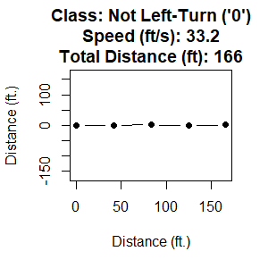
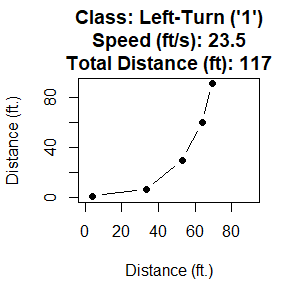
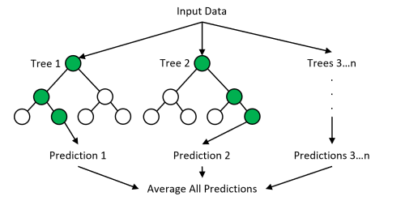

```{r setup, include=FALSE}
knitr::opts_chunk$set(echo = TRUE)
knitr::opts_chunk$set(
  fig.path = ".img/README_"
)
```

<a name="machine-learning-with-maneuvers"></a>

# [atet](https://github.com/atet) / [**_ml_maneuver_**](https://github.com/atet/ml_maneuver#machine-learning-with-maneuvers)

# Machine Learning with Maneuvers

---

<a name="table-of-contents"></a>

## Table of Contents

* [Background](#background)
* [Truth Data](#truth-data)
* [Machine Learning](#machine-learning)
   * [Training](#training)
   * [Testing](#testing)
   * [Deploying](#deploying)

---

<a name="background"></a>

## Background

We will leverage technology that will allow computer code to learn from example data, then use what it has learned from the data to automatically distinguish between different classes of data.


[**Back to Top**](#table-of-contents)

---

<a name="truth-data"></a>

## Truth Data

The truth data below represents data in which a human has determined whether the data are of one class or another (not left-turns vs. left-turns)

[](#nolink) [](#nolink)

* 50 examples of a person driving straight (25 examples) and a person making a left-turn (25 examples)
* The data points are represented by five `X` and `Y` coordinate pairs (in feet) that are collected at 1 Hz (once per second)
  * The first `X`,`Y` pair is `feature_1`, `feature_2` and so on

```{r chunk_id_turns_1}
truth_data = read.csv("./dat/turns.csv")
str(truth_data)
```

Additional summary statistics of the data for travel speed (feet/s) and total distance traveled (feet)

```{r chunk_id_turns_2}
# Between 22-36 miles per hour
summary(truth_data$speed_fps)
summary(truth_data$total_distance)
```

NOTE: Must convert the label number to factor (`0` = not left-turn, `1` = left-turn) for subsequent compatibility

```{r chunk_id_turns_3}
truth_data$label = as.factor(truth_data$label)
```

* We will train the computer code on 40/50 examples (20 of each non left-turn and left-turn)
* Additionally, 10/50 examples are reserved for later testing of the machine learned model (5 of each non left-turn and left-turn)

```{r chunk_id_turns_4}
train = truth_data[truth_data$split == "train",]
test = truth_data[truth_data$split == "test",]
```

[**Back to Top**](#table-of-contents)

---

<a name="machine-learning"></a>

## Machine Learning

We will train a random forest algorithm to create a model that will serve as the classifier to automatically distinguish future, unforeseen examples of not left-turns and left-turns.

What will happen with the random forest algorithm is that **random subsets** of the data are taken to make **decision trees** that conform to the **known labels** of the truth data. Once a large collection of these random decision trees are made, each will vote towards a consensus.

[](#nolink)

The final "forest" of these random decision trees _could_ be a high performing model that can automatically discern between the different classes of data. 

[**Back to Top**](#table-of-contents)

---

<a name="training"></a>

## Machine Learning: Training

Random forest parameters:

* 500 decisions trees generated
* Random sampling of 26/40 training samples (~63%) with replacement
* Random sampling of 3/10 variables with replacement

```{r chunk_ml_train_1, message = FALSE}
library(randomForest) # randomForest version 4.6-14
rf_model = randomForest(
   label ~ .,
   data = train[,-c(2,3,14)]
)
```

Given the training data and the model's training parameters, we see no error in the [confusion matrix](https://en.wikipedia.org/wiki/Confusion_matrix):

* 20 of not left-turns were classified correctly as not left-turns (with no false positives)
* 20 of left-turns were classified correctly as left-turns (with no false negatives)

```{r chunk_ml_train_2}
print(rf_model)
```

[**Back to Top**](#table-of-contents)

---

<a name="testing"></a>

## Machine Learning: Testing

Now that the machine learning model is built, we will validate it against a hold-out set of test data to measure its performance on data (also known and labeled) in which the model was not trained upon.

```{r chunk_ml_test_1}
prediction = predict(rf_model, newdata = test[,-c(1,2,3,14)])
```

Just like the training performance, we see no error in the [confusion matrix](https://en.wikipedia.org/wiki/Confusion_matrix) from the test data:

```{r chunk_ml_test_2}
confusion_matrix = table(unlist(test[,1]), prediction)
print(confusion_matrix)
```

[**Back to Top**](#table-of-contents)

---

<a name="deploying"></a>

## Machine Learning: Deploying

As far as deploying this model as a production-ready algorithm, more exploration may be required.

* _Are all of the variables truly important?_ Evaluate variable importance.
* _Does the model performance meet your needs?_ Tune parameters.
* _Did you train on enough data?_ Get more data.

**There are many options to move forward to improve your machine learned models.**

[**Back to Top**](#table-of-contents)

---

> NOTE: Must manually add footer in `README.md` for correct rendering in GitHub: `<p align="center">Copyright &copy; 2021-&infin; <a href="https://www.athitkao.com" target="_blank">Athit Kao</a>, <a href="https://www.athitkao.com/tos.html" target="_blank">Terms and Conditions</a></p>`

---