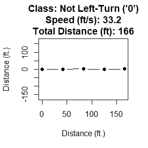
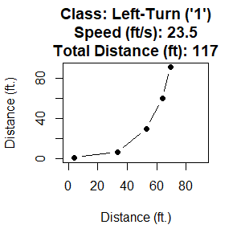

<a name="machine-learning-with-maneuvers"></a>

# [atet](https://github.com/atet) / [***ml\_maneuver***](https://github.com/atet/ml_maneuver#machine-learning-with-maneuvers)

[](#nolink)

# Machine Learning with Maneuvers

------------------------------------------------------------------------

<a name="table-of-contents"></a>

## Table of Contents

-   [Background](#background)
-   [Truth Data](#truth-data)
-   [Machine Learning](#machine-learning)
    -   [Training](#training)
    -   [Testing](#testing)
    -   [Deploying](#deploying)

------------------------------------------------------------------------

<a name="background"></a>

## Background

TODO

[**Back to Top**](#table-of-contents)

------------------------------------------------------------------------

<a name="truth-data"></a>

## Truth Data

TODO

[](#nolink) [](#nolink)

``` r
truth_data = read.csv("./dat/turns.csv")
str(truth_data)
```

    ## 'data.frame':    50 obs. of  14 variables:
    ##  $ label         : int  0 0 0 0 0 0 0 0 0 0 ...
    ##  $ speed_fps     : num  33.2 43.2 39.4 34.9 33.3 ...
    ##  $ total_distance: num  166 216 197 175 166 ...
    ##  $ feature_1     : num  0 0 0 0 0 0 0 0 0 0 ...
    ##  $ feature_2     : num  -0.512 0.643 -0.464 1.11 -0.456 ...
    ##  $ feature_3     : num  41.5 54 49.3 43.6 41.6 ...
    ##  $ feature_4     : num  0.291 0.516 1.079 1.739 -1.946 ...
    ##  $ feature_5     : num  83.1 108 98.5 87.3 83.1 ...
    ##  $ feature_6     : num  1.6328 -1.7529 -0.0092 -1.1514 -0.4704 ...
    ##  $ feature_7     : num  125 162 148 131 125 ...
    ##  $ feature_8     : num  -1.193 -1.176 0.87 0.607 1.479 ...
    ##  $ feature_9     : num  166 216 197 175 166 ...
    ##  $ feature_10    : num  1.594 -1.294 1.968 -1.498 -0.639 ...
    ##  $ split         : chr  "train" "train" "train" "train" ...

``` r
summary(truth_data$speed_fps)
```

    ##    Min. 1st Qu.  Median    Mean 3rd Qu.    Max. 
    ##   22.91   26.70   33.24   33.40   39.87   54.12

``` r
summary(truth_data$total_distance)
```

    ##    Min. 1st Qu.  Median    Mean 3rd Qu.    Max. 
    ##   114.5   133.5   166.2   167.0   199.4   270.6

``` r
truth_data$label = as.factor(truth_data$label)
```

``` r
train = truth_data[truth_data$split == "train",]
test = truth_data[truth_data$split == "test",]
```

[**Back to Top**](#table-of-contents)

------------------------------------------------------------------------

<a name="machine-learning"></a>

## Machine Learning

TODO

[**Back to Top**](#table-of-contents)

------------------------------------------------------------------------

<a name="training"></a>

## Machine Learning: Training

TODO

``` r
library(randomForest)
```

    ## randomForest 4.6-14

    ## Type rfNews() to see new features/changes/bug fixes.

``` r
rf_model = randomForest(
   label ~ .,
   data = train[,-c(2,3,14)]
)
```

[**Back to Top**](#table-of-contents)

------------------------------------------------------------------------

<a name="testing"></a>

## Machine Learning: Testing

TODO

``` r
prediction = predict(rf_model, newdata = test[,-c(1,2,3,14)])
confusion_matrix = table(unlist(test[,1]), prediction)
print(confusion_matrix)
```

    ##    prediction
    ##     0 1
    ##   0 5 0
    ##   1 0 5

[**Back to Top**](#table-of-contents)

------------------------------------------------------------------------

<a name="deploying"></a>

## Machine Learning: Deploying

TODO

[**Back to Top**](#table-of-contents)

------------------------------------------------------------------------

<p align="center">Copyright &copy; 2021-&infin; <a href="https://www.athitkao.com" target="_blank">Athit Kao</a>, <a href="https://www.athitkao.com/tos.html" target="_blank">Terms and Conditions</a></p>

------------------------------------------------------------------------
